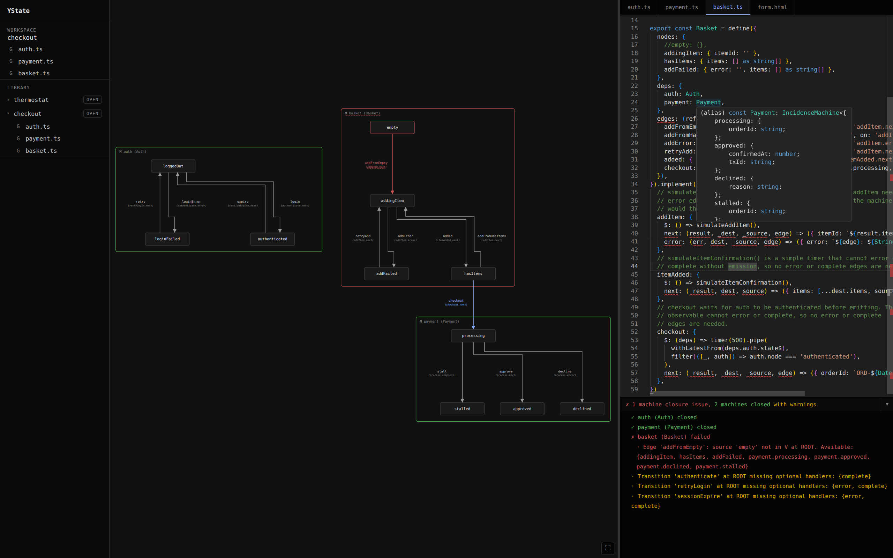

# YState Studio

**[Live at ystate.github.io](https://ystate.github.io/)**

Software behavior is invisible. You write code, it runs, but you never see the full picture: what states the system can be in, how it moves between them, what happens when things go wrong. You hold all of that in your head, and your head is wrong. Edge cases hide until they break in production.

State machines fix this by making behavior a concrete, verifiable thing. But most tooling treats visualization as a separate step: draw a diagram, export it, paste it into a wiki, watch it rot. The diagram is disconnected from the code. It helps once, then lies forever.

YState Studio is a design environment where your code and its behavior are the same thing. You write state machines in a live TypeScript editor. The studio reads what you wrote and draws it: every state, every connection, every relationship between machines. Change the code, the picture changes. There is no export step. There is no sync problem. There is nothing to keep up to date.

The studio checks your work continuously. It tells you when a connection points to something that doesn't exist, when a piece is missing, when machines don't fit together. You don't find out at runtime. You find out as you type.

Machines run inside the studio. You wire up inputs, start the machine, and watch it go. State changes are real. The graph animates to show you where the machine is and how it got there. You can explore every path and test every scenario before the code goes anywhere near production.

The code you write in the studio is the same code your application uses. There is no translation layer, no export format, no generated glue. What runs in the studio runs in production.

YState Studio is for anyone building systems where behavior matters: multi-step flows, authentication, payments, hardware control, anything where "what state is the system in?" is a question worth answering. It makes behavior visible, testable, and real.
